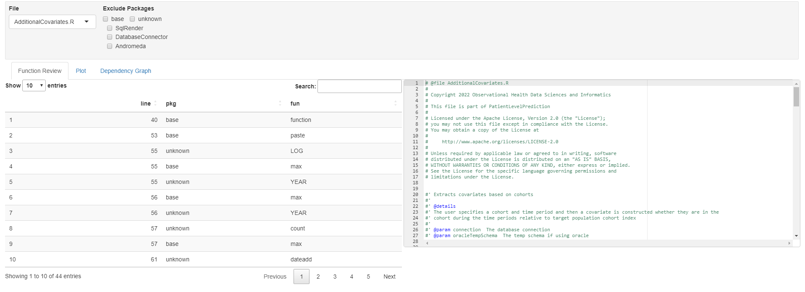
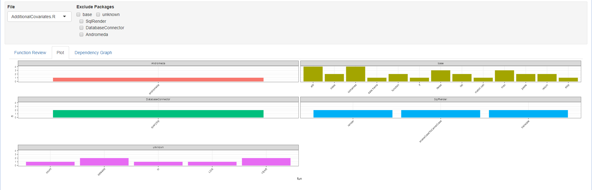
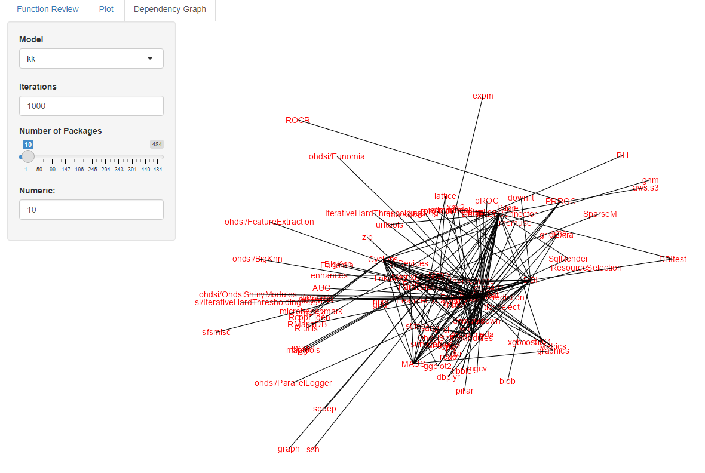

<!-- README.md is generated from README.Rmd. Please edit that file -->

```{r, include = FALSE}
knitr::opts_chunk$set(
  collapse = TRUE,
  comment = "#>",
  fig.path = "man/figures/README-",
  out.width = "100%"
)
```

# DependencyReviewer

<!-- badges: start -->
[](https://www.tidyverse.org/lifecycle/#experimental)
<!-- badges: end -->

## Table of Contents
1. [Installation](#Installation)
2. [Examples](#Examples)
3. [ShinyApp](#ShinyApp)
4. [To do](#To-do)


## Installation <a name="Installation"></a>

You can install the development version of DependencyReviewer like so:
``` r
install.packages("remotes")
remotes::install_github("darwin-eu/DependencyReviewer")
```


## Examples <a name="Examples"></a>
Check whether dependencies in the description file are approved and whether the required version matches the current recommendation.
```{r, message=FALSE}
library(DependencyReviewer)
library(dplyr)
library(ggplot2)
library(pander)
```

Without any options set, it will review the package you are currently inside:
```{r}
checkDependencies()
```
*getDefaultPermittedPackages* gets a table of all the 'permitted' packages in the accompanying csv-file.
```{r}
pander(head(getDefaultPermittedPackages()))
```

Function use of all .R files can be investigated using the _sumariseFunctionUse_ function. It assumes the function is is ran inside an R-project, and will automatically look for the files in the */R* folder. Functions where no package could not be found for, are binned under the *unknown* package. Usually base functions are not used as `base::mean()`. Therefore the function goes through all the base functions to bin them under the *base* package rather than *unknown*.
```{r}
r_files <- list.files(here::here("R"))

function_use <- summariseFunctionUse(r_files)

pander(head(function_use))
```

The output could be plotted like so:
```{r, fig.height=10}
function_sub <- function_use %>% 
  filter(!pkg %in% c("unknown", "base"))

fun_counts <- function_sub %>% group_by(fun, pkg, name = "n") %>% tally()

ggplot(
  data = fun_counts, 
  mapping = aes(x = fun, y = n, fill = pkg)) +
  geom_col() +
  facet_wrap(
    vars(pkg), 
    scales = "free_x", 
    ncol = 2) +
  theme_bw() +
  theme(
    legend.position = "none",
    axis.text.x = (element_text(angle = 45, hjust = 1, vjust = 1)))
```

*unknown* and *base* are filtered out, and the functions are being tallied up for each package.

*getGraphData* allows to easily get graph data for all the dependencies.
```{r, message=FALSE, fig.height=5, fig.width=5}
graphData <- getGraphData()

library(igraph)
library(ggraph)

ggraph(
  graph = graphData, 
  layout = "dendrogram",
  circular = TRUE) +
  ggraph::geom_edge_diagonal() +
  ggraph::geom_node_text(
    check_overlap = TRUE,
    mapping = ggplot2::aes(
      x = x * 1.005,
      y = y * 1.005,
      label = name,
      angle = -((-ggraph::node_angle(x, y) + 90) %% 180) + 90),
    size = 3,
    colour = "red",
    hjust = 'outward') + 
  theme_void()
```

If you would like to investigate dependencies there is a package named [PAK](https://pak.r-lib.org/dev/reference/features.html) that allows you to do various things like that. It is used in *DependencyReviewer* as a dependency to get all the dependency information.
```{r}
library(pak)

pkg_deps("darwin-eu/DependencyReviewer")
```
To lint your entire package you can use:
```{reval=FALSE}
darwinLintPackage()
```

Sometimes a package might be to large to lint entirely, so you can lint per file instead
```{reval=FALSE}
darwinLintFile()
```

## ShinyApp <a name="ShinyApp"></a>

Dependency Reviewer now includes a shiny app, which encapsulates all the 
functionality available in the package. The app consist of two sections:

The shiny app is launched using
```{r, eval=FALSE}
runShiny()
```

1. Function Review (Function Review and Plot tab)


This panel shows the locations of functions per file. The file can be changed in the top left. Packages that are found in this file can be filtered out, if desired.

In a table on the left all functions are shown, with what package they're from and in what line they're found in the file. On the right the file being investigated is shown.


The *Plot* panel shows bar plots per package which are found in the investigated file. Filtering can be used to exclude packages.


2. Dependency Graph (Dependency Graph tab)


In the final tab panel a graph is shown of all packages and their dependencies. On the left hand side several options are shown. 1) *Layout* the layout of the graph; 2) *iterations* Number of iterations (if applicable for the selected layout) 3) *Number of Dependency layers* the amount of dependencies shown, with _their_ dependencies, as a slider, or numeric value.

## To do <a name="To-do"></a>

1. Add an options to provide a path rather than file names to summariseFunctionUse.
2. Update list of dependencies.
3. Add lintr functionality using the Hades style guide from OHDSI.
