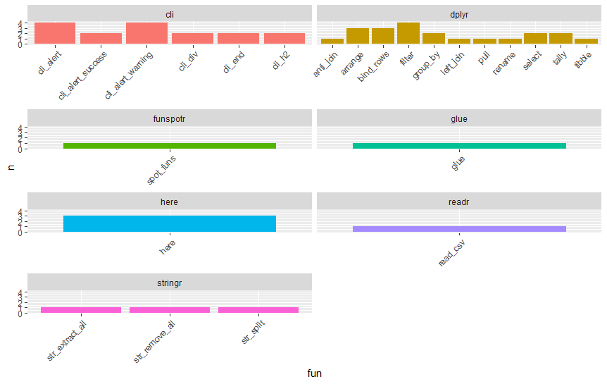

<!-- README.md is generated from README.Rmd. Please edit that file -->

# DependencyReviewer

<!-- badges: start -->

[](https://www.tidyverse.org/lifecycle/#experimental)
<!-- badges: end -->

## Installation

You can install the development version of DependencyReviewer like so:

``` r
install.packages("remotes")
remotes::install_github("darwin-eu/DependencyReviewer")
```

## Example

Check whether dependencies in the description file are approved and
whether the required version matches the current recommendation.

``` r
library(DependencyReviewer)
library(CodelistGenerator)
library(dplyr)
#> 
#> Attaching package: 'dplyr'
#> The following objects are masked from 'package:stats':
#> 
#>     filter, lag
#> The following objects are masked from 'package:base':
#> 
#>     intersect, setdiff, setequal, union
library(ggplot2)
```

Without any options set, it will review the package you are currently
inside:

``` r
checkDependencies()
#> 
#> -- Checking if packages in Imports and Depends have been approved --
#> 
#> ! Found 1 package in Imports and Depends that are not approved
#> >   1) desc
#> ! Please open an issue at https://github.com/darwin-eu/IncidencePrevalence to
#> request approval for packages (one issue per package).
#> 
#> -- Checking if packages in Imports and Depends require recommended version --
#> 
#> ! Found 1 package in Imports and Depends with a different version required
#> >   1) dplyr
#> >     currently required: *
#> >     should be: >= 1.0.0
#> ! Please require recommended versions
```

``` r
function_use<-summariseFunctionUse() 

function_use %>% 
  filter(pkgs!="(unknown)") %>% 
  filter(pkgs!="base") %>% 
  filter(pkgs!="methods") %>% 
  ggplot()+
  geom_col(aes(funs,n, fill=pkgs)) +
  facet_wrap(vars(pkgs),scales  = "free_x", ncol=2) +
  theme(legend.position = "none",
        axis.text.x = (element_text(angle = -90)))
```


