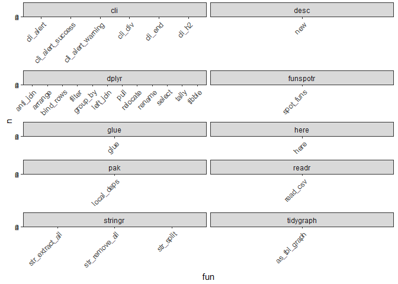

<!-- README.md is generated from README.Rmd. Please edit that file -->

# DependencyReviewer

<!-- badges: start -->

[](https://www.tidyverse.org/lifecycle/#experimental)
<!-- badges: end -->

## Installation

You can install the development version of DependencyReviewer like so:

``` r
install.packages("remotes")
remotes::install_github("darwin-eu/DependencyReviewer")
```

## Example

Check whether dependencies in the description file are approved and
whether the required version matches the current recommendation.

``` r
library(DependencyReviewer)
library(CodelistGenerator)
library(dplyr)
#> 
#> Attaching package: 'dplyr'
#> The following objects are masked from 'package:stats':
#> 
#>     filter, lag
#> The following objects are masked from 'package:base':
#> 
#>     intersect, setdiff, setequal, union
library(ggplot2)
```

Without any options set, it will review the package you are currently
inside:

``` r
checkDependencies()
#> 
#> ── Checking if packages in Imports and Depends have been approved ──
#> 
#> ! Found 4 packages in Imports and Depends that are not
#> approved
#> →   1) desc
#> →   2) funspotr
#> →   3) here
#> →   4) readr
#> ! Please open an issue at https://github.com/darwin-eu/IncidencePrevalence
#> to request approval for packages (one issue per package).
#> 
#> ── Checking if packages in Imports and Depends require recommended version ──
#> 
#> ! Found 1 package in Imports and Depends with a different
#> version required
#> →   1) dplyr
#> →     currently required: *
#> →     should be: >= 1.0.0
#> ! Please require recommended versions
```

``` r
r_files <- list.files(here::here("R"))

function_use <- summariseFunctionUse(r_files)

head(function_use)
#> # A tibble: 6 × 5
#> # Groups:   fun, pkg, line [6]
#>   fun       pkg      line r_file                     n
#>   <chr>     <chr>   <int> <chr>                  <int>
#> 1 list      unknown   101 checkDependencies.R        2
#> 2 anti_join dplyr      32 checkDependencies.R        1
#> 3 arrange   dplyr      23 summariseFunctionUse.R     1
#> 4 arrange   dplyr      36 checkDependencies.R        1
#> 5 arrange   dplyr     140 summariseFunctionUse.R     1
#> 6 bind_rows dplyr      20 summariseFunctionUse.R     1
```

``` r
function_sub <- function_use %>% 
  filter(pkg != "unknown") %>% 
  filter(pkg != "base") %>% 
  filter(pkg != "methods")

ggplot(
  data = function_sub, 
  mapping = aes(x = fun, y = n, fill = pkg)) +
  geom_col() +
  facet_wrap(
    vars(pkg), 
    scales = "free_x", 
    ncol=2) +
  theme_bw() +
  theme(
    legend.position = "none",
    axis.text.x = (element_text(angle = 45, hjust = 1, vjust = 1)))
```


