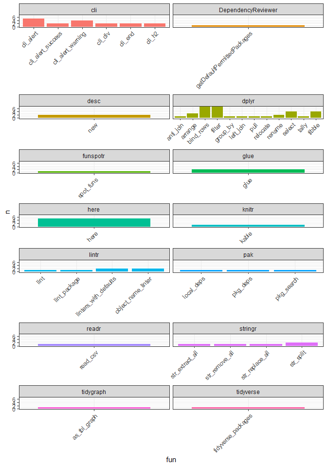

<!-- README.md is generated from README.Rmd. Please edit that file -->

# DependencyReviewer

<!-- badges: start -->

[](https://lifecycle.r-lib.org/articles/stages.html#experimental/)
<!-- badges: end -->

## Table of Contents

1.  [Installation](#Installation)
2.  [Examples](#Examples)
3.  [ShinyApp](#ShinyApp)
4.  [To do](#To-do)

## Installation <a name="Installation"></a>

You can install the development version of DependencyReviewer like so:

``` r
install.packages("remotes")
remotes::install_github("darwin-eu/DependencyReviewer")
```

DependencyReviewer is now also availible on [CRAN](https://cran.r-project.org/web/packages/DependencyReviewer/index.html).
```
install.packages("DependencyReviewer")
```

## Examples <a name="Examples"></a>

Check whether dependencies in the description file are approved and
whether the required version matches the current recommendation.

``` r
library(DependencyReviewer)
library(dplyr)
library(ggplot2)
library(pander)
```

Without any options set, it will review the package you are currently
inside:

``` r
checkDependencies()
#> ℹ Loading metadata databaseℹ Loading metadata database✔ Loading metadata database ... done✔ Loading metadata database ... done
#> 
#> Writing temp file
#> 
#> ── Checking if packages in Imports and Depends have been approved ──
#> 
#> ! Found 3 packages in Imports and Depends that are not
#> approved
#> →   1) GGally
#> →   2) lintr
#> →   3) pak
#> ! Please create a new issue at https://github.com/mvankessel-EMC/DependencyReviewerWhitelists/ to request approval for packages with the following message:
#> → |package |version |date                | downloads_last_month|license            |url                                                              |
#> |:-------|:-------|:-------------------|--------------------:|:------------------|:----------------------------------------------------------------|
#> |GGally  |2.1.2   |2021-06-21 03:40:10 |                85560|GPL (>= 2.0)       |https://ggobi.github.io/ggally/, https://github.com/ggobi/ggally |
#> |lintr   |3.0.2   |2022-10-19 08:52:37 |                62675|MIT + file LICENSE |https://github.com/r-lib/lintr, https://lintr.r-lib.org          |
#> |pak     |0.3.1   |2022-09-08 20:30:02 |                41813|GPL-3              |https://pak.r-lib.org/                                           |
```

*getDefaultPermittedPackages* gets a table of all the ‘permitted’
packages in the accompanying csv-file.

``` r
pander(head(getDefaultPermittedPackages()))
#> Get from temp file
```

|  X  |  package  | version |
|:---:|:---------:|:-------:|
|  1  | codetools |  4.2.0  |
|  2  |   base    |  4.2.1  |
|  3  |   boot    |  4.2.1  |
|  4  |   class   |  4.2.1  |
|  5  |  cluster  |  4.2.1  |
|  6  | codetools |  4.2.1  |

Function use of all .R files can be investigated using the
*sumariseFunctionUse* function. It assumes the function is is ran inside
an R-project, and will automatically look for the files in the */R*
folder. Functions where no package could not be found for, are binned
under the *unknown* package. Usually base functions are not used as
`base::mean()`. Therefore the function goes through all the base
functions to bin them under the *base* package rather than *unknown*.

``` r
r_files <- list.files(here::here("R"))

function_use <- summariseFunctionUse(r_files)

pander(head(function_use))
```

|       r_file        | line |  pkg  |    fun    |
|:-------------------:|:----:|:-----:|:---------:|
| checkDependencies.R |  27  | base  | function  |
| checkDependencies.R |  29  | dplyr |  filter   |
| checkDependencies.R |  29  | base  |   is.na   |
| checkDependencies.R |  30  | dplyr |  rename   |
| checkDependencies.R |  31  | dplyr | left_join |
| checkDependencies.R |  33  | base  |     c     |

The output could be plotted like so:

``` r
function_sub <- function_use %>% 
  filter(!pkg %in% c("unknown", "base"))

fun_counts <- function_sub %>% group_by(fun, pkg, name = "n") %>% tally()

ggplot(
  data = fun_counts, 
  mapping = aes(x = fun, y = n, fill = pkg)) +
  geom_col() +
  facet_wrap(
    vars(pkg), 
    scales = "free_x", 
    ncol = 2) +
  theme_bw() +
  theme(
    legend.position = "none",
    axis.text.x = (element_text(angle = 45, hjust = 1, vjust = 1)))
```



*unknown* and *base* are filtered out, and the functions are being
tallied up for each package.

*getGraphData* allows to easily get graph data for all the dependencies.

``` r
graphData <- getGraphData()

library(igraph)
library(ggraph)

ggraph(
  graph = graphData, 
  layout = "dendrogram",
  circular = TRUE) +
  ggraph::geom_edge_diagonal() +
  ggraph::geom_node_text(
    check_overlap = TRUE,
    mapping = ggplot2::aes(
      x = x * 1.005,
      y = y * 1.005,
      label = name,
      angle = -((-ggraph::node_angle(x, y) + 90) %% 180) + 90),
    size = 3,
    colour = "red",
    hjust = 'outward') + 
  theme_void()
```


If you would like to investigate dependencies there is a package named
[PAK](https://pak.r-lib.org/dev/reference/features.html) that allows you
to do various things like that. It is used in *DependencyReviewer* as a
dependency to get all the dependency information.

``` r
library(pak)

pkg_deps("darwin-eu/DependencyReviewer")
#> # A data frame: 141 × 32
#>    ref       type  direct direc…¹ status package version license needs…² prior…³
#>    <chr>     <chr> <lgl>  <lgl>   <chr>  <chr>   <chr>   <chr>   <lgl>   <chr>  
#>  1 darwin-e… gith… TRUE   TRUE    OK     Depend… 1.0.0   Apache… TRUE    <NA>   
#>  2 DBI       stan… FALSE  FALSE   OK     DBI     1.1.3   LGPL (… FALSE   <NA>   
#>  3 DT        stan… FALSE  FALSE   OK     DT      0.26    GPL-3 … FALSE   <NA>   
#>  4 GGally    stan… FALSE  FALSE   OK     GGally  2.1.2   GPL (>… FALSE   <NA>   
#>  5 MASS      stan… FALSE  FALSE   OK     MASS    7.3-58… GPL-2 … FALSE   recomm…
#>  6 Matrix    stan… FALSE  FALSE   OK     Matrix  1.5-3   GPL (>… FALSE   recomm…
#>  7 R6        stan… FALSE  FALSE   OK     R6      2.5.1   MIT + … FALSE   <NA>   
#>  8 RColorBr… stan… FALSE  FALSE   OK     RColor… 1.1-3   Apache… FALSE   <NA>   
#>  9 Rcpp      stan… FALSE  FALSE   OK     Rcpp    1.0.9   GPL (>… FALSE   <NA>   
#> 10 askpass   stan… FALSE  FALSE   OK     askpass 1.1     MIT + … FALSE   <NA>   
#> # … with 131 more rows, 22 more variables: md5sum <chr>, sha256 <chr>,
#> #   filesize <int>, built <chr>, platform <chr>, rversion <chr>,
#> #   repotype <chr>, repodir <chr>, target <glue>, deps <list>, mirror <chr>,
#> #   sources <list>, remote <list>, error <list>, metadata <list>,
#> #   dep_types <list>, params <list>, sysreqs <chr>, cache_status <chr>,
#> #   lib_status <chr>, old_version <chr>, new_version <chr>, and abbreviated
#> #   variable names ¹​directpkg, ²​needscompilation, ³​priority
```

To lint your entire package you can use:

```
darwinLintPackage()
```

Sometimes a package might be to large to lint entirely, so you can lint
per file instead

```
darwinLintFile()
```

## ShinyApp <a name="ShinyApp"></a>

Dependency Reviewer now includes a shiny app, which encapsulates all the
functionality available in the package. The app consist of two sections:

The shiny app is launched using

``` r
runShiny()
```

1.  Function Review (Function Review and Plot tab)

 This panel shows the
locations of functions per file. The file can be changed in the top
left. Packages that are found in this file can be filtered out, if
desired.

In a table on the left all functions are shown, with what package
they’re from and in what line they’re found in the file. On the right
the file being investigated is shown.

 The *Plot* panel shows bar
plots per package which are found in the investigated file. Filtering
can be used to exclude packages.

2.  Dependency Graph (Dependency Graph tab)

 In the final tab
panel a graph is shown of all packages and their dependencies. On the
left hand side several options are shown. 1) *Layout* the layout of the
graph; 2) *iterations* Number of iterations (if applicable for the
selected layout) 3) *Number of Dependency layers* the amount of
dependencies shown, with *their* dependencies, as a slider, or numeric
value.

## To do <a name="To-do"></a>

1.  Add an options to provide a path rather than file names to
    summariseFunctionUse.
2.  Update list of dependencies.
3.  Add lintr functionality using the Hades style guide from OHDSI.
