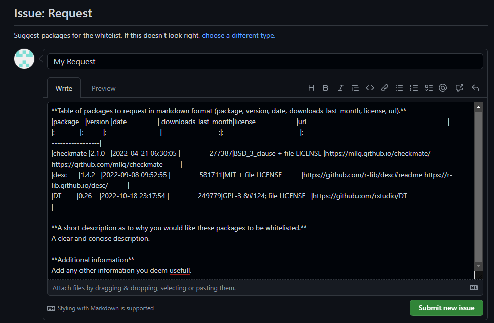
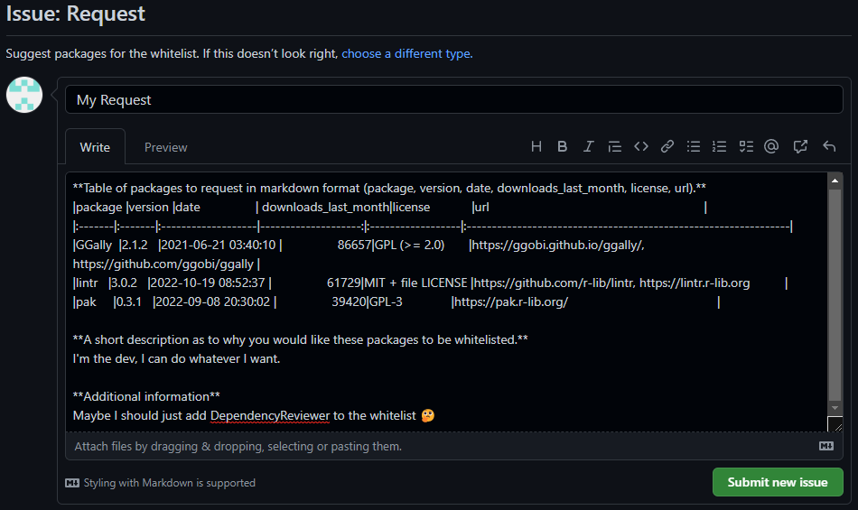
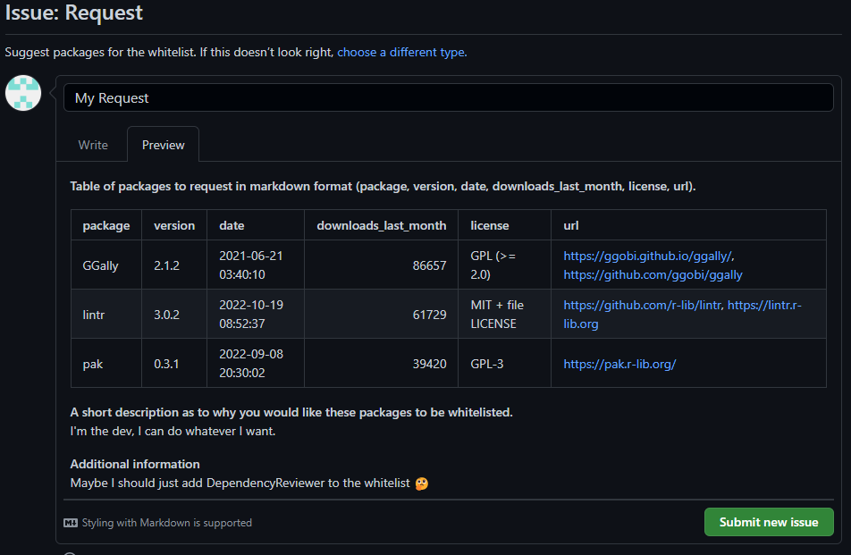
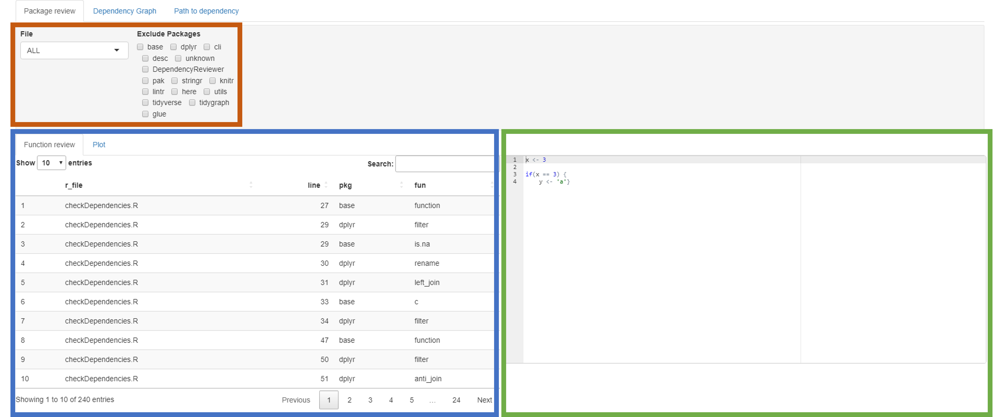
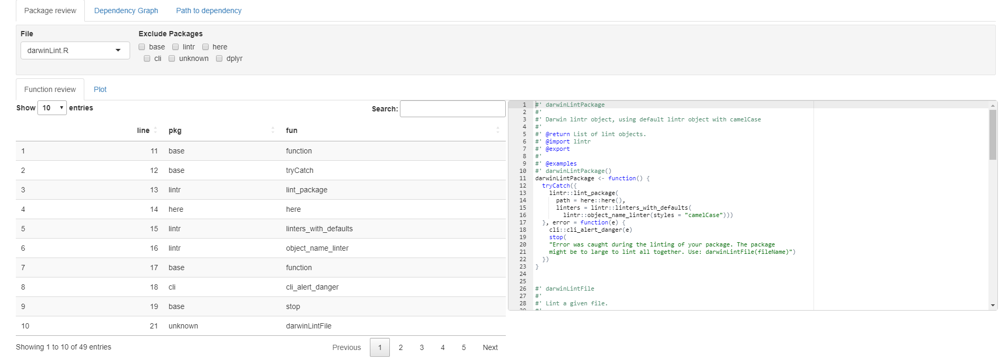
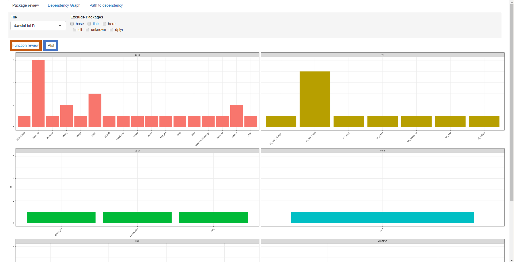
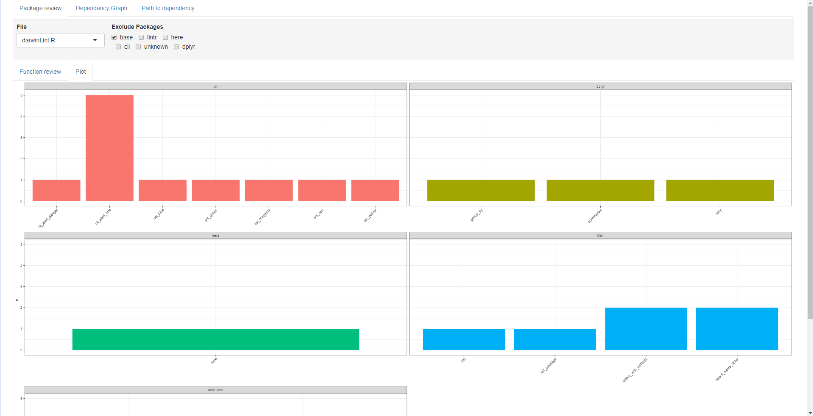
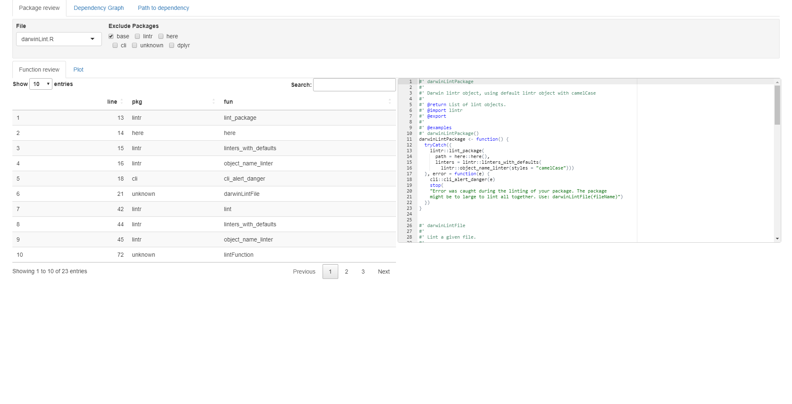
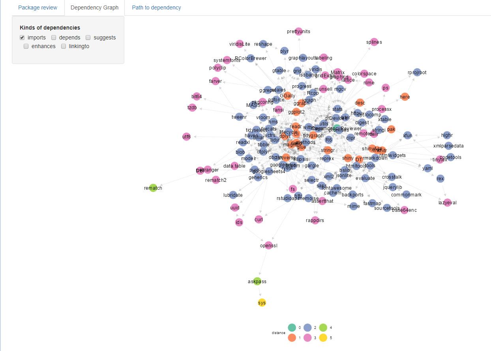
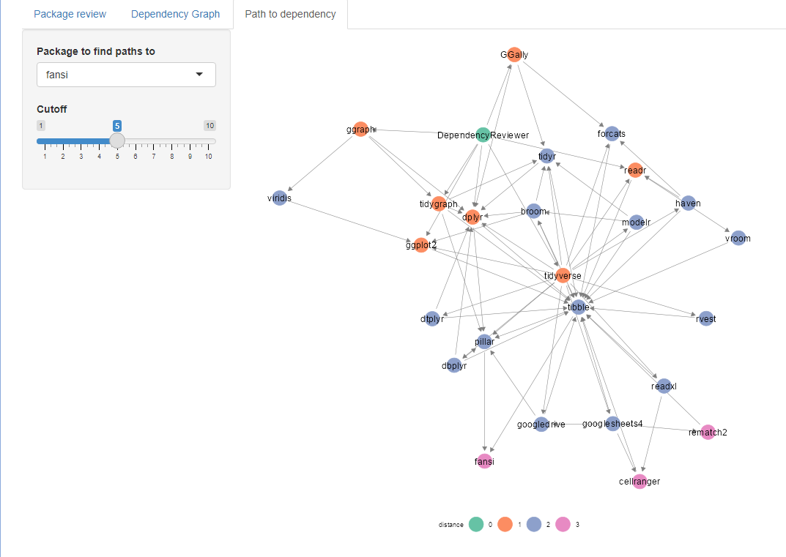

```{r, include = FALSE}
knitr::opts_chunk$set(
  collapse = TRUE,
  comment = "#>"
)
```

## Installation
Before anything, make sure the _DependencyReviewer_ package is installed.

### remotes
The latest version is usually available on GitHub, and is installable with the _remotes_ package.
```{r installationRemotes, eval = FALSE}
# If you do not have remotes installed:
install.packages("remotes")

# Install DependencyReviewer with remotes:
remotes::install_github("darwin-eu/DependencyReviewer")
```

### install.packages
_DependencyReviewer 1.0.0_ is also available on CRAN, and can be installed using `install.packages` as well.

```{r installationBase, eval=FALSE}
install.packages("DependencyReviewer")
```

## Usage
```{r loadPackages, setup, message=FALSE}
library(DependencyReviewer)

# Other packages that are used in the examples
library(DT)
library(ggplot2)
library(dplyr)
library(igraph)
library(GGally)
```

### getDefaultPermittedPackages
#### What does it do?
The `getDefaultPermittedPackages` function retrieves a list of packages from several on,- and offline data sources. These data sources include:

1. Base packages with a high priority `installed.packages(lib.loc = .Library, priority = "high")`
2. [Tidyverse packages](https://github.com/mvankessel-EMC/DependencyReviewerWhitelists/blob/main/TidyverseDependencies.csv)
3. [OHDSI/HADES packages](https://github.com/OHDSI/Hades/blob/main/extras/packages.csv)
4. Packages hosted on the [_DependencyReviewerWhitelists_ repository](https://github.com/mvankessel-EMC/DependencyReviewerWhitelists/blob/main/dependencies.csv)
5. Finally the function will also retrieve the defined packages' dependencies recursively, and add them to the list.

These packages are deemed _OK_ to use. This list will, and should change overtime as packages become outdated, get replaced, or added to the list.

#### What does it need?
`getDefaultPermittedPackages` does not require any arguments.

#### What does it return?
`getDefaultPermittedPackages` returns a class of data.frame with columns: _package <character>_ and _version <character>_

```{r, echo=FALSE}
library(withr)
local_envvar(
  R_USER_CACHE_DIR = tempfile()
)
```

```{r getDefaultPermittedPackages}
datatable(getDefaultPermittedPackages())
```

### checkDependencies
#### What does it do?
Now that we have defined our 'whitelisted' packages, `checkDependencies` allows us to check our currently used dependencies against it. `checkDependencies` will run `getDefaultPermittedPackages` internally so there is no need to run the two separately to check your dependencies against the white list.

#### What does it need?
`checkDependencies` has two optional arguments:

1. **packageName** default (`NULL`): Expects a character string of a package name. Example: _"ggplot2"_.

2. **dependencyType** default (`c("Imports", "Depends")`): Expects a character vector of at least length 1 of dependency types. The supported types are: _"Imports"_, _"Depends"_, and _"Suggests"_.

Because both arguments are optional it can also be run without specifying anything. The function will then assume that it is run **inside** a package-project environment. This is specifically useful when working on, or reviewing a package.

#### What does it return?
`checkDependencies` prints out a message in the console that informs the user if all their used package dependencies are whitelisted or not. If not it instructs the user where to go to request the packages to be whitelisted.

```{r, eval=FALSE}
# Assumes the current environment is a package-project
# Defaults are: packageName = NULL, packageTypes = c("Imports", "Depends")
checkDependencies()

# Check dependencies for installed package "dplyr"
checkDependencies(
  packageName = "dplyr"
)
```

1. If packages are not approved yet:
```{r}
# Check Imports and Suggests
checkDependencies(
  packageName = "dplyr",
  dependencyType = c("Imports", "Suggests")
)
```

As you can see, it returns a list of all the packages that are not white listed. Below the list it will display some information in a _markdown table_ format. This will come in handy later on. The table has six columns: **1**) package, **2**) version, **3**) date, **4**) downloads_last_month, **5**) license, and **6**) url.

Note that only packages available on CRAN are reported in the table. Non-CRAN packages will still show up in the list.

2. If all packages are approved:
```{r}
# Only check directly imported dependencies of installed package "dplyr"
checkDependencies(
  packageName = "dplyr",
  dependencyType = c("Imports")
)
```

Notice how _"Imports"_ and _"Depends"_ packages of dplyr are whitelisted, but _"Suggests"_ packages are not.

### Requesting packages to be whitelisted
If you find that some packages are not yet whitelisted, you can request them to be. The [DependencyReviewerWhitelists](https://github.com/mvankessel-EMC/DependencyReviewerWhitelists) repository on GitHub houses the white list for _DependencyReviewer_.

To request new packages a new issue can be created on this repository.

Assuming we have the following output from `checkDependencies`:

```
Get from temp file

── Checking if packages in Imports and Suggests have been approved ──

! Found 3 packages in Imports and Suggests that are not
approved
→   1) GGally
→   2) lintr
→   3) pak
! Please create a new issue at https://github.com/mvankessel-EMC/DependencyReviewerWhitelists/ to request approval for packages with the following message:
|package |version |date                | downloads_last_month|license            |url                                                              |
|:-------|:-------|:-------------------|--------------------:|:------------------|:----------------------------------------------------------------|
|GGally  |2.1.2   |2021-06-21 03:40:10 |                86657|GPL (>= 2.0)       |https://ggobi.github.io/ggally/, https://github.com/ggobi/ggally |
|lintr   |3.0.2   |2022-10-19 08:52:37 |                61729|MIT + file LICENSE |https://github.com/r-lib/lintr, https://lintr.r-lib.org          |
|pak     |0.3.1   |2022-09-08 20:30:02 |                39420|GPL-3              |https://pak.r-lib.org/                                           |
```

When creating a new issue, a request template is available.

```{r, echo=FALSE, out.width="100%", fig.cap="Request template button"}

```

This template asks for some basic information about the requested packages, and a reason as to why the requested packages should be whitelisted.

```{r, echo=FALSE, out.width="100%", fig.cap="Request template"}

```

Initially it displays some dummy information as to what a request might look like.

Firstly it asks us is to supply a table in markdown format with some basic information about the packages. We can copy this from the output message from the `checkDependencies` function.

Then it asks us to give a description as to why we would like these packages to be whitelisted.

Finally, we can add some additional information if required.

```{r, echo=FALSE, out.width="100%", fig.cap="Request filled out"}

```

We can then preview our request issue:

```{r, echo=FALSE, out.width="100%", fig.cap="Request preview"}

```

If everything looks good, we can submit the issue.

### summariseFunctionUse
#### What does it do?
`summariseFunctionUse` goes through all specified R-files and attempts to list all the functions used in those files. It will also report in what file the function was found, at what line number the function call was found, and from which package the function comes from.

#### What does it need?
`summariseFunctionUse` has several optional arguments:

1. **r_files** default (list.files(here::here("R"))): If `in_package = TRUE` expects a character vector of at least length 1 of file names in the _/R/_ folder. If `in_package == FALSE` expects full paths to the R-files.

2. **verbose** default (FALSE): If `verbose = TRUE` will print messages in the console on which file the function is currently working. Useful when reviewing large R-files. If `verbose = FALSE` will not print said messages.

3. **in_package** default (TRUE): If `in_package = TRUE` will expect that the function is run inside a package-project. If `in_package = FALSE` will expect that the function is run outside a package-project and will expect full file paths to the files reviewed.

By default `summariseFunctionUse` will expect that it is ran inside a package-project and will look at the _/R/_ folder inside the project.

#### What does it return?
`summariseFunctionUse` returns a class of data.frame with the following columns:  _r_file_, _line_, _pkg_, _fun_.

```{r}
# Assumes the function is run inside a package-project.
datatable(
  summariseFunctionUse(list.files(here::here("R"), full.names = TRUE)
))
```

```{r}
if (interactive()) {
  # Any other R-file, with verbose messages
  foundFuns <- summariseFunctionUse(
    r_files = "../inst/testScript.R",
    verbose = TRUE
  )

  datatable(foundFuns)
}
```

The found functions can then be plotted out for each package. For the sake of this demonstration, only a few packages will be plotted.
```{r dpi=250, fig.height=10, out.width="100%"}
if (interactive()) {
  funCounts <- foundFuns %>%
    group_by(fun, pkg, name = "n") %>%
    tally() %>%
    dplyr::filter(pkg %in% c("checkmate", "DBI", "dplyr"))

  ggplot(
    data = funCounts,
    mapping = aes(x = fun, y = n, fill = pkg)
  ) +
    geom_col() +
    facet_wrap(
      vars(pkg),
      scales = "free_x",
      ncol = 1
    ) +
    theme_bw() +
    theme(
      legend.position = "none",
      axis.text.x = (element_text(angle = 45, hjust = 1, vjust = 1))
    )
}
```


### getGraphData
#### What does it do?
`getGraphData` creates an igraph graph object of all the dependencies that the root package depends on. This includes direct and transitive dependencies.

#### What does it need?
`getGraphData` has three optional parameters:

1. **path** default (here::here()): Path to the package to get the graph data of. By default assumes that the function is ran inside a package-project.

2. **excluded_packages** default (c("")): A character vector of packages to be excluded. By default is empty.

3. **package_types** default (c("imports", "depends")): Package dependency types to be included. By default imports and depends are included. Availible types are: **1**) _"imports"_, **2**) _"depends"_, **3**) _"suggests"_, **4**) _"enhances"_, **5**) _"linkingto"_

Without any of these specified, the `getGraphData` function assumes that it is ran inside an package-project. 

#### What does it return?
`getGraphData` returns a class of igraph.
```{r eval=FALSE}
graphData <- getGraphData()
```
Because the amount of dependencies in the graph quickly get out of hand, it is suggested that you would either filter the igraph object after the fact, or only look at one kind of package type. In the following example we'll look at _"Imports"_ only to keeps things simple.

It could then be plotted like so:

```{r, out.width="100%", dpi=500, messages=FALSE}
# Get graphData with only imports
graphData <- getGraphData("./")

# Calculate colour of nodes based on distances from root package
cols <- factor(as.character(apply(
  X = distances(graphData, V(graphData)[1]),
  MARGIN = 2,
  FUN = max
)))

# Plot graph
ggnet2(
  net = graphData,
  arrow.size = 1,
  arrow.gap = 0.025,
  label = TRUE,
  palette = "Set2",
  color.legend = "distance",
  color = cols,
  legend.position = "bottom",
  edge.alpha = 0.25,
  node.size = 2.5,
  label.size = 1,
  legend.size = 2
)
```

### runShiny
#### What does it do?
`runShiny` runs a local shiny app that houses all the before mentioned functionality in one environment. `runSHiny` assumes that it is being ran inside a package-project.

#### What does it need?
`runShiny` Takes no arguments

#### What does it return?
runShiny returns a class of shiny.appobj.

```{r eval=FALSE}
runShiny()
```

The shiny application has three main tabs: **1**) Package review, **2**) Dependency Graph, and **3**) Path to dependency.

<u>Package review</u>

On the package review tab there are three main panels.

1. <span style="color:#C55A11">**Settings**</span>: The settings have two parts on this panel: A file picker, and tick boxes to packages. Currently all the files are in the summariseFunctionUse table.

2. <span style="color:#4472C4">**summariseFunctionUse table and plot**</span>: The summariseFunctionUse table for the specified files, or all files if _ALL_ is picked in the file picker in the settings.

3. <span style="color:#70AD47">**Script preview**</span>: A preview of the contents of the selected file. If _ALL_ is chosen, a dummy script will appear, or the last viewed contents will stay.
```{r, echo=FALSE, out.width="100%", fig.cap="Function review"}

```

Notice how the <span style="color:#C55A11">**Settings**</span>, <span style="color:#4472C4">**summariseFunctionUse table and plot**</span>, and <span style="color:#70AD47">**Script preview**</span> dynamically change when the darwinLint.R file is selected.
```{r, echo=FALSE, out.width="100%", fig.cap="Package review"}

```

When swapping from the <span style="color:#C55A11">**Function review**</span> to the <span style="color:#4472C4">**Plot**</span> tab a bar graph is shown for each package used in the file. The bars represent the amount of function calls in that file per package.
```{r, echo=FALSE, out.width="100%", fig.cap="Function review plot"}

```

Lets say base functions are not interesting for your use case, you can then tick the _base_ tick box in the Exclude Packages in the settings.

```{r, echo=FALSE, out.width="100%", fig.cap="Package review"}

```

_base_ packages are now excluded from both the <span style="color:#4472C4">**summariseFunctionUse table and plot**</span>.

```{r, echo=FALSE, out.width="100%", fig.cap="Package review"}

```

<u>Dependency Graph</u>

The Dependency Graph tab displays a graph, like plotted earlier, using the `graphData` function. On the right-hand-side different kinds of dependencies are able to be chosen to be included in the graph.
```{r, echo=FALSE, out.width="100%", fig.cap="Package review"}

```

<u>Path to dependency</u>

The path to dependency tab displays how the root package depends on any recursive dependency.

On the right-hand-side a dependency found somewhere included in the root package can be chosen. A cutoff can be defined to limit the distance from the root package to the chosen dependency.
```{r, echo=FALSE, out.width="100%", fig.cap="Package review"}

```

### darwinLintFile
#### What does it do?
`darwinLintFile` is an extension of the default Lintr object, but instead of _snake_case_, it uses _camelCase_. As the name suggest it will run the lintr on a specified file.

#### What does it need?
`darwinLintFile` takes one parameter:
1. **fileName**: Path to an R-file.

#### What does it return?
It returns a class of lints.

However the output of a lintr function can be cast to a data.frame.
```{r warning=FALSE, error=FALSE, message=FALSE}
if (interactive()) {
  lintOut <- data.frame(
    darwinLintFile(
      fileName = "../inst/testScript.R"
    )
  )
}
```

Which can then be manipulated to get a summary of lint messages.
```{r}
if (interactive()) {
  lintOut %>%
    group_by(type, message) %>%
    tally(sort = TRUE) %>%
    datatable()
}
```


### darwinLintPackage
#### What does it do?
`darwinLintPackage` is an extension of the default Lintr object, but instead of _snake_case_, it uses _camelCase_. But unlike `darwinLintFile`, will run the lintr on the entire package. Therefore it will assume that the function is ran inside a package-project.

#### What does it need?
`darwinLintPackage` Does not take any arguments.

#### What does it return?
It returns a class of lints.

### darwinLintScore
#### What does it do?
`darwinLintScore` calculates a percentage per type of lint-message from the lintr.

The percentage is calculated as:

$$darwinLintScore_{type} = \frac{n_{messages}}{n_{lines}} \times 100 $$

#### What does it need?
`darwinLintScore` takes one predefined argument:
1. **lintFunction**: A lint function extended from `lintr::lint_package` or `lintr::lint`
2. **...**: Any other arguments that the lint function might need

#### What does it return?
Returns a class of data.frame with two columns: **1**) type, and **2**) pct.

It will also print out colour coded messages with the percentages per message type.
```{r eval=FALSE}
if (interactive()) {
  darwinLintScore(darwinLintPackage)
}
```
```
i style: 5.9% of lines of code have linting messages
i warning: 0.95% of lines of code have linting messages
```

|    type |   pct |
| ------- | ----- |
|   style |   5.9 |
| warning |  0.95 |
